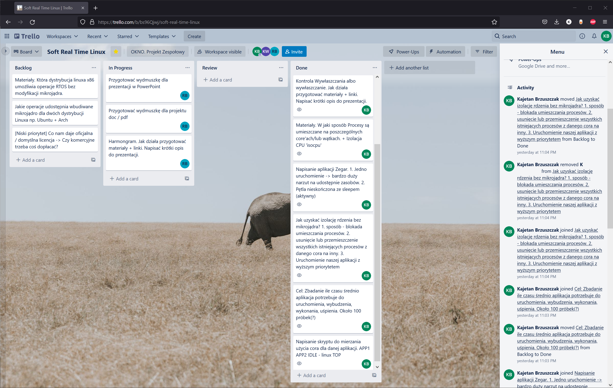
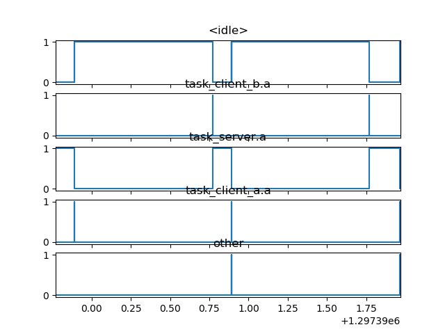
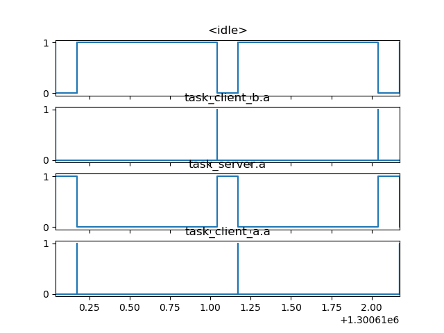
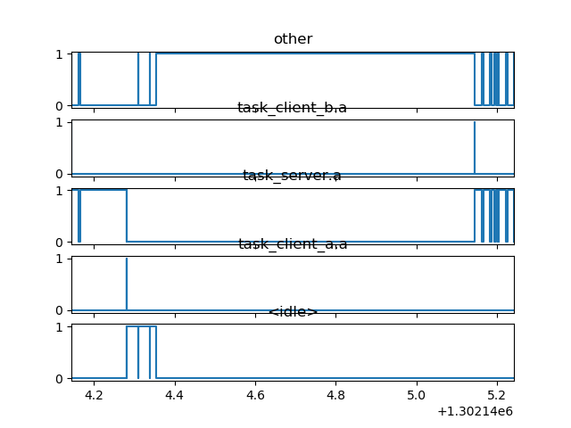

# <p align="center"> Propozycja implementacji systemu Soft Real Time Linux bez udziału mikrojąda RTLinux dla aplikacji z rygorem wykonywania zadania poniżej 1ms </p>
## <p align="center">Projekt Zespołowy </br>Politechnika Warszawska </br>OKNO </p>

## Zespół
Skład zespołu:
* Kajetan Brzuszczak 301023 (KB)
* Anonymous1 (KW)
* Anonymous2 (RB)

Kajetan Brzuszczak pełnił rolę kierownika projektu oraz przygotował analizę problemu.

## Założenia projektu
Problemy zadań czasu rzeczywistego rozwiązywane są różnymi sposobami. Popularnym wysokopoziomowym rozwiązaniem jest skompilowanie i wgranie mikrojądra RTLinux na licencji OpenSource. Niestety ingerencja w jądro systemu nie zawsze jest możliwa, dlatego celem tego projektu jest zbadanie możliwości wbudowanego kernela dla jednej ze znanych dystrybucji i manipulowanie zadaniami lub procesami z poziomu konsoli lub aplikacji korzystającej z glibc, tak, aby wykonywały się w przewidywalnym czasie. Wyzwaniem będzie izolowanie aplikacji pomiędzy rdzeniami, gdzie domyślnie ta opcja jest ograniczona bez instalacji mikrojądra.

Zakładamy, że celem jest Soft Real Time, gdzie przekroczenie czasu wykonania nie skutkuje krytycznym błędem, ale obniża znacznie jakość usługi. Punktem odniesienia będzie wykonywanie zadań w ciągu 1ms.
Podsumowanie będzie zawierało analizę sukcesu projektu.

## Współpraca
W celu usprawnienia współpracy wybraliśmy parę narzędzi
* Komunikator Messenger firmy Facebook, gdzie mogliśmy szybko wymieniać wiadomości
* Microsoft Teams w celu prowadzenia wideokonferencji i polepszenia kondycji zespołu w pracy zdalnej 
* Trello, czyli tablicę Kanban w celu wizualnego podziału obowiązków. Każda osoba z zespołu mogła wziąć jeden element backlogu aby nad nim pracować. 
* Pliki trzymaliśmy w chmurze na dysku OneDrive, gdzie każdy mógł wrzucać wyniki swojej pracy

Przykładowy zrzut ekranu z rozpisaniem tablicą Kanban w aplikacji Trello  


Przykładowy zrzut ekranu ze współdzieloną przestrzenią na pliki 


## Analiza problemu
Implementację Soft Real Time Linux podzieliliśmy na mniejsze problemy, opisane poniżej, gdzie w końcowym rozrachunku sama konfiguracja linux'a stanowiła mniejszą cześć projektu. Większą była przygotowanie aplikacji do testów oraz wykonanie wiarygodnych pomiarów.

### Systemy Real Time
Zrozumienie, czym jest system czasu rzeczywistego, było wstępem do projektu. RTOS jest po pierwsze systemem operacyjnym, czyli jego zadaniem jest zarządzanie zadaniami (ang. task), który muszą działać pod rygorem wykonania w określonym czasie. Same task'i muszą być zaprojektowane względem wykonywanego zadania uwzględniając ryzyko przekroczenia czasu wykonania np. w systemach life-safety przekroczenia maksymalnego czasu wykonania zadania może grozić śmiercią poprzez za długie napromieniowanie, albo niewyłączenie elementu mechanicznego.

### Analiza porównawcza systemu Hard a Soft
Wybierając pomiędzy żmudnym projektowaniem task'ów, a wygodą rozwoju oprogramowania może się zdarzyć, że potrzebujemy wykonać zadanie w określonym czasie, ale przekroczenie limitu czasowego nie wywoła poważnych szkód, a skończy się błędem jedynie błędem lub opóźnieniem dostarczenia wiadomości. Za przykład może służyć sieć LTE z 1ms ramkami danych. Przerwa w sieci w trakcie wysyłania SMS nie oznacza, że on przepadnie, ale zostanie dostarczony później. 

### Analiza problemu
System operacyjny odpowiada za wiele istotnych zadań, między innymi udostępnia bezpieczny interfejs do komunikowania się z zasobami sytemu oraz za uruchamianie zadań i dzielenie czasu procesora pomiędzy nimi.
Za przydział czasu procesora odpowiada osobny moduł planista (ang. scheduler). Na nim będzie skupiony projekt. To on uruchamia process, zatrzymuje i wstrzymuje (ang run/pause/run). W najprostszym przypadku posiadając jeden procesor, każde zadanie będzie na przemian uruchamiane i wznawiane dając iluzje zrównoleglenia (ang. parallelism) niewidoczną dla użytkownika, ale technicznie nie będzie możliwości wykonywania dwóch operacji na raz.
W przypadku, gdy użytkownik zechce, aby dać priorytet zadaniu jest to możliwe, ale dalej będzie nieprzewidywalne

Wychodząc z powyższych założeń musimy przeanalizować rodzaje dostępnych planistów i sposoby ograniczenie wpływu innych procesów na wykonanie dedykowanego zadania.

### Planiści
Planiści we współczesnych komputerach uruchamiają procesy "sprawiedliwie", czyli pozwalają każdemu procesowi na użycie cząstki procesora, co wpływa na to, że są nieprzewidywalni. "CFS - Completely Fair Scheduler", czyli "Całkowicie Sprawiedliwy Planista" jest aktualnie używany.

Dostępni planiści POSIX:
* SCHED_BATCH
* SCHED_DEADLINE
* SCHED_FIFO
* SCHED_IDLE
* SCHED_OTHER - Domyślny CFS wcześniej O(1)
* SCHED_RR

W naszym przypadku, nie chcemy być sprawiedliwi, ale wykonywać zadania jedno za drugim w celu minimalizacji czasu spania (IDLE). Takie warunki spełni SCHED_FIFO, gdzie skończone zadanie już czeka w kolejce do wykonania. 

### Izolowanie 
Poza manipulacją planistami istnieją sposoby na spriorytezowanie samych procesów. Komenda 'Nice' uruchamia proces dając możliwość wywłaszczenia go w każdym momencie czasu. Możemy np uruchomić wszystkie procesy poza dedykowanym w tym trybie co pozwoli na wysoki priorytet tego procesu

Inną opcją jest izolacja procesora - albo właściwiej - rdzenia. Możemy skonfigurować tak jądro systemu, aby zabronić mu wykonywać lub uruchamiać zadania na izolowanym rdzeniu. W ten sposób mamy pewność, że obciążenie systemu nie wpłynie na wydajność naszej aplikacji.

Sam sprzęt musi posiadać dwu-rdzeniowy procesor, abyśmy mieli możliwość izolacji CPU, gdzie reszta jest wykorzystywana na procesy Użytkownika. 

### Wybór dystrybucji systemu Linux
Szukany system musi umożliwiać izolowanie CPU, oraz wybór planisty. Analiza wykazała, że całość wymaganej funkcjonalności znajduje się od dawna w Kernelu, więc sprawdzanie wersji niekoniecznie jest potrzebne.

Dodatkowym wymaganiem wynikającym z analizy jest użycie tylko dedykowanego Systemu Operacyjnego. Nie możemy używać systemu na wirtualnej maszynie, WSL w windows, czy chmury. Nawet jeżeli wirtualne maszyny byłyby skonfigurowane pod wymagania, to nie mamy pewności czy host nie uruchamia procesów na dedykowanym CPU, co by zakłamało wyniki

Możliwe dystrybucje
1. SUSE Linux
1. Ubuntu
1. Debian

Ze względu na brak możliwości instalacji Linux'a na komputerze osobistym. Zdecydowaliśmy na użycie dystrybucji debian dla RaspberryPi.

Specyfikacja sprzętu
```txt
Model:     RaspberryPi 4
Processor: ARM 4-rdzeniowy 1.6GHz
Pamięć:    4GB
```
### Wybór narzędzi
1. 

### Potencjalne wady
Lista wad rozwiązania
1. Rozwiązanie Niestandardowe - w przypadku problemów ciężko będzie znaleźć rozwiązanie
1. Izolowanie CPU zamyka możliwość innych nie-izolowanych procesów na użycie czasu procesora, ograniczamy w ten sposób wydajność
1. Projektowanie zadania - aplikacja musi przeanalizowana pod kątem najdłuższej ścieżki i dopasowana do wymagań, co wydłuża development
1. Nietrywialna obserwacja - zaobserwowanie różnicy wywłaszczania przez scheduler i wykonanie pomiarów jest żmudne z powodu małych czasów, co za tym idzie, nie mamy pewności zysku.
1. Nieznana wydajność - aby porównać wydajność potrzebujemy aplikacji, która może działać zarówno na dedykowanym procesorze i jak domyślnym/losowym. W dużych projektach, nie jest możliwe przeniesienie takiej aplikacji w czasie w którym możemy porównać wydajność.
1. Wspólne zasoby - Pomimo izolacji na poziomie CPU dostęp do Kernela lub HW jest już współdzielony, więc inne procesy dalej mogą pośrednio wpływać na te na dedykowanym rdzeniu.

## Weryfikacja Systemu Soft Real Time

Weryfikacja:
* Izolacja CPU  
  
* Izolacja CPU z dodatkowym obciążeniem systemu  
  
* Izolacja CPU z dodatkowym obciążeniem systemu, bez przypisania zadań do odizolowanego CPU  
  
### Aplikacja

### Skrypty

# Bibiliografia
* Sched - Manual Linux  
https://man7.org/linux/man-pages/man7/sched.7.html 
* Sched Affinity – Manual Linux  
https://linux.die.net/man/2/sched_setaffinity 
* Cron Manual  
https://man7.org/linux/man-pages/man8/cron.8.html
* RT Linux Manual  
https://wiki.t-firefly.com/en/Firefly-Linux-Guide/manual_rtlinux.html
* Chroniona dokumentacja projektu Soft Real Time

