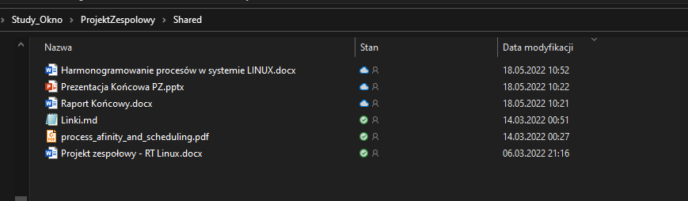
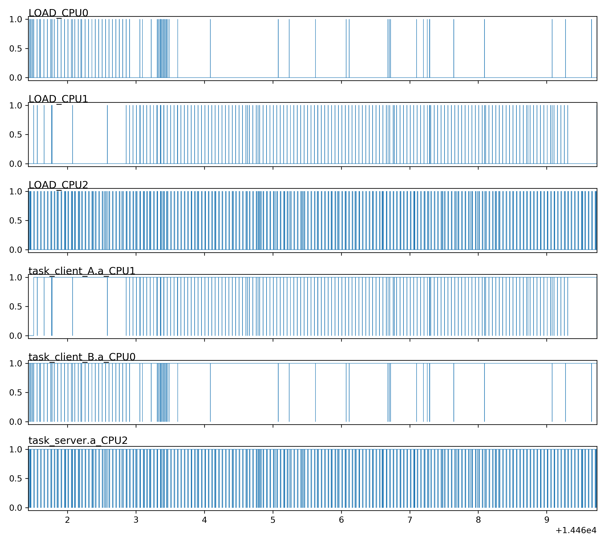
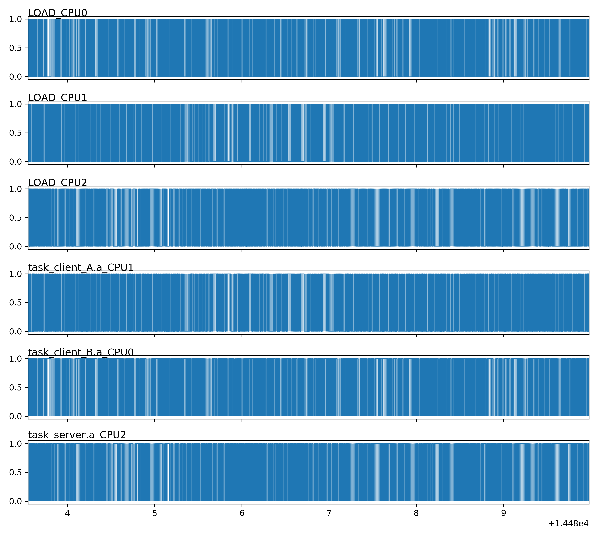
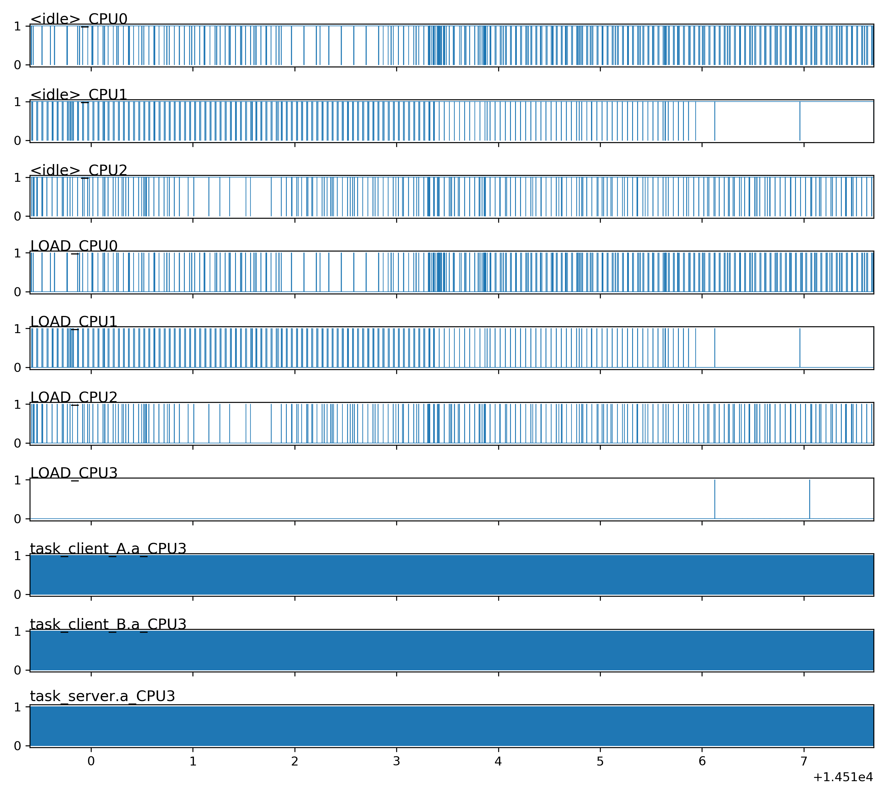
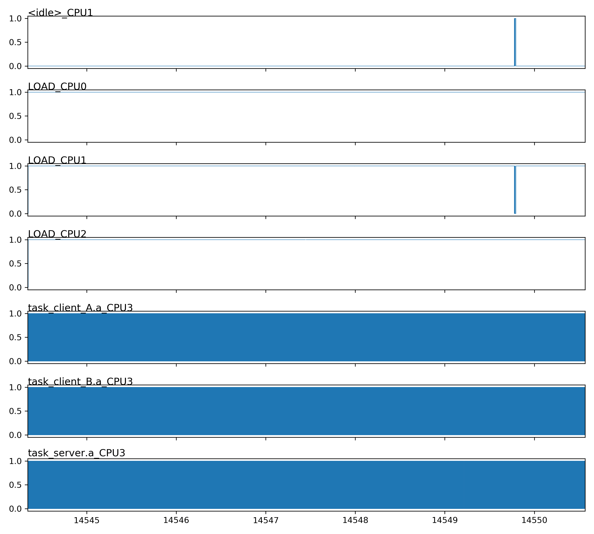
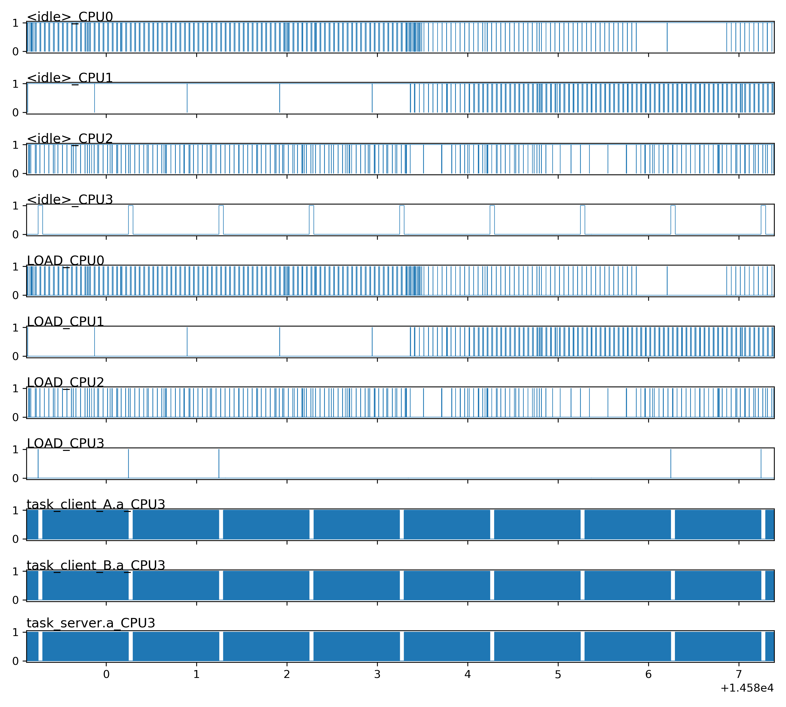

# <p align="center"> Propozycja implementacji systemu Soft Real Time Linux bez udziału mikrojąda RTLinux dla aplikacji z rygorem wykonywania zadania poniżej 1ms </p>
## <p align="center">Projekt Zespołowy </br>Politechnika Warszawska </br>OKNO </p>

# Wstęp
## Zespół
Skład zespołu:
* Kajetan Brzuszczak 301023 (KB)
* Anonymous1 (KW)
* Anonymous2 (RB)

Kajetan Brzuszczak pełnił rolę kierownika projektu oraz przygotował analizę problemu.

## Założenia projektu
Problemy zadań czasu rzeczywistego rozwiązywane są różnymi sposobami. Popularnym wysokopoziomowym rozwiązaniem jest skompilowanie i wgranie mikrojądra RTLinux na licencji OpenSource. Niestety ingerencja w jądro systemu nie zawsze jest możliwa, dlatego celem tego projektu jest zbadanie możliwości wbudowanego kernela dla jednej ze znanych dystrybucji i manipulowanie zadaniami lub procesami z poziomu konsoli lub aplikacji korzystającej z glibc, tak, aby wykonywały się w przewidywalnym czasie. Wyzwaniem będzie izolowanie aplikacji pomiędzy rdzeniami, gdzie domyślnie ta opcja jest ograniczona bez instalacji mikrojądra.

Zakładamy, że celem jest system Soft Real Time, gdzie przekroczenie czasu wykonania nie skutkuje krytycznym błędem, ale obniża znacznie jakość usługi. Punktem odniesienia będzie wykonywanie zadań w ciągu 1ms. Podsumowanie będzie zawierało analizę sukcesu projektu.

## Współpraca
W celu usprawnienia współpracy wybraliśmy parę narzędzi
* Komunikator Messenger firmy Facebook, gdzie mogliśmy szybko wymieniać wiadomości
* Microsoft Teams w celu prowadzenia wideokonferencji i polepszenia kondycji zespołu w pracy zdalnej 
* Trello, czyli tablicę Kanban w celu wizualnego podziału obowiązków. Każda osoba z zespołu mogła wziąć jeden element backlogu aby nad nim pracować. 
* Pliki trzymaliśmy w chmurze na dysku OneDrive, gdzie każdy mógł wrzucać wyniki swojej pracy

Przykładowy zrzut ekranu z rozpisaniem tablicą Kanban w aplikacji Trello  


Przykładowy zrzut ekranu ze współdzieloną przestrzenią na pliki 


# Analiza problemu
Implementację Soft Real Time Linux podzieliliśmy na mniejsze problemy, opisane poniżej, gdzie w końcowym rozrachunku sama konfiguracja linux'a stanowiła mniejszą cześć projektu. Większą była przygotowanie aplikacji do testów oraz wykonanie wiarygodnych pomiarów.

## Systemy Real Time
Zrozumienie, czym jest system czasu rzeczywistego, było wstępem do projektu. RTOS jest po pierwsze systemem operacyjnym, czyli jego zadaniem jest zarządzanie zadaniami (ang. task), który muszą działać pod rygorem wykonania w określonym czasie. Same task'i muszą być zaprojektowane względem wykonywanego zadania uwzględniając ryzyko przekroczenia czasu wykonania np. w systemach life-safety przekroczenia maksymalnego czasu wykonania zadania może grozić śmiercią poprzez za długie napromieniowanie, albo niewyłączenie elementu mechanicznego.

## Analiza porównawcza systemu Hard a Soft
Wybierając pomiędzy żmudnym projektowaniem task'ów, a wygodą rozwoju oprogramowania może się zdarzyć, że potrzebujemy wykonać zadanie w określonym czasie, ale przekroczenie limitu czasowego nie wywoła poważnych szkód, a skończy się błędem jedynie błędem lub opóźnieniem dostarczenia wiadomości, w zamian zyskując szybkie dowożenie funkcjonalności przez developerów. Za przykład może służyć sieć LTE z 1ms ramkami danych. Przerwa w sieci w trakcie wysyłania SMS nie oznacza, że on przepadnie, ale zostanie dostarczony później. 

## Analiza problemu
System operacyjny odpowiada za wiele istotnych zadań, między innymi udostępnia bezpieczny interfejs do komunikowania się z zasobami sytemu oraz za uruchamianie zadań i dzielenie czasu procesora pomiędzy nimi.
Za przydział czasu procesora odpowiada osobny moduł planista (ang. scheduler). Na nim będzie skupiony projekt. To on uruchamia process, zatrzymuje i wstrzymuje (ang run/pause/run). W najprostszym przypadku posiadając jeden procesor, każde zadanie będzie na przemian uruchamiane i wznawiane dając iluzje zrównoleglenia (ang. parallelism) niewidoczną dla użytkownika, ale technicznie nie będzie możliwości wykonywania dwóch operacji na raz.
W przypadku, gdy użytkownik zechce, aby dać priorytet zadaniu jest to możliwe, ale dalej będzie nieprzewidywalne

Wychodząc z powyższych założeń musimy przeanalizować rodzaje dostępnych planistów i sposoby ograniczenie wpływu innych procesów na wykonanie dedykowanego zadania.

## Planiści
**Dostępni Planiści**
Planiści we współczesnych komputerach uruchamiają procesy "sprawiedliwie", czyli pozwalają każdemu procesowi na użycie cząstki procesora, co wpływa na to, że są nieprzewidywalni. "CFS - Completely Fair Scheduler", czyli "Całkowicie Sprawiedliwy Planista" jest aktualnie używany.

Dostępni planiści POSIX:
* SCHED_BATCH
* SCHED_DEADLINE
* SCHED_FIFO
* SCHED_IDLE
* SCHED_OTHER - Domyślny CFS wcześniej O(1)
* SCHED_RR

W naszym przypadku, nie chcemy być sprawiedliwi, ale wykonywać zadania jedno za drugim w celu minimalizacji czasu spania (IDLE). Takie warunki spełni SCHED_FIFO, gdzie skończone zadanie już czeka w kolejce do wykonania. 

**Planista FIFO**
SCHED_FIFO: Planista typu "pierwszy wchodzi pierwszy wychodzi".
SCHED_FIFO może być tylko użyty z procesami z priorytetem wyższym niż 0, co znaczy, że kiedy proces FIFO startuje od razu wywłaszcza inne procesy korzystające z planisty OTHER, BATCH, bądź IDLE. Planista SCHED_FIFO jest prostym algorytmem bez time-slicing. 

Poniższe reguły są stosowane w przypadku użycia planisty SCHED_FIFO
1. Raz wywłaszczony proces zostaje uśpiony i położony na koniec kolejki dla swojego priorytetu i pozostaje zablokowany tak długo, aż wszystkie procesy z wyższym priorytetem nie zostaną zatrzymane.
1. Zablokowanie procesu umieszcza go z powrotem na koniec kolejki z danym priorytetem.
1. Jeżeli zmienimy konfigurację planisty dla danego procesu następujące reguły są zaaplikowane.
    * Jeżeli priorytet procesu został zwiększony zostaje on umieszczony na końcu kolejki z nowym priorytetem. Co może skutkować  natychmiastowym wywłaszczaniem procesów z niższym priorytetem.
    * Jeżeli priorytet procesu pozostał niezmieniony, to jego pozycja w kolejca nie ulega zmianie.
    * Jeżeli priorytet procesy został zmniejszony, to zostaje on umieszczony na początku kolejki z nowym priorytetem. 
1. Proces korzystający z sched_yield zostaje automatycznie umieszczony na końcu swojej kolejki FIFO

Proces FIFO może zostać zablokowany przez:
* Zapytanie do systemu o zasoby I/O 
* Wywłaszczony przez proces o wyższym priorytecie
* Proces wywoła metodę sched_yield

## Izolowanie 
Poza manipulacją planistami istnieją sposoby na spriorytezowanie samych procesów. Przykładowo narzędziem 'Nice' możemy uruchomić proces dając możliwość wywłaszczenia go w każdym momencie czasu. Możemy np uruchomić wszystkie procesy poza dedykowanym w tym trybie co pozwoli na wysoki priorytet tego procesu.

Inną opcją jest izolacja procesora - albo właściwiej - rdzenia. Możemy skonfigurować tak jądro systemu, aby zabronić mu wykonywać lub uruchamiać zadania na izolowanym rdzeniu. W ten sposób mamy pewność, że obciążenie systemu nie wpłynie na wydajność naszej aplikacji.

Sam sprzęt musi posiadać co najmniej dwu-rdzeniowy procesor. W innym przypadku procesy systemowe nie mogłyby zostać wyizolowane i badanie byłoby niemożliwe do wykonania.

## Wybór dystrybucji systemu Linux
Szukany system musi umożliwiać izolowanie CPU, oraz wybór planisty. Analiza wykazała, że całość wymaganej funkcjonalności znajduje się od dawna w Kernelu. To wymaganie zakłada użycie dystrybucji z odpowiednią wersją jądra, a sprawdzenie dystrybucji i wersji Linux nie jest istotne potrzebne.

Dodatkowym wymaganiem wynikającym z analizy jest użycie tylko dedykowanego Systemu Operacyjnego. Nie możemy używać systemu na wirtualnej maszynie, WSL w windows, czy chmury. Nawet jeżeli wirtualne maszyny byłyby skonfigurowane pod wymagania, to nie mamy pewności czy host nie uruchamia procesów na dedykowanym CPU, co by zakłamało wyniki

Możliwe dystrybucje
1. SUSE Linux
1. Ubuntu
1. Debian

Ze względu na brak możliwości instalacji Linux'a na komputerze osobistym. Zdecydowaliśmy na użycie dystrybucji debian dla RaspberryPi.

Specyfikacja sprzętu
```txt
Model:     RaspberryPi 4
Processor: ARM 4-rdzeniowy 1.6GHz
Pamięć:    4GB
```
## Wybór narzędzi
1. Skrypty:
    * python3 z matlabplot - rysowanie wykresów
    * bash - automatyzacja
1. Aplikacja:
    * testy: C++ z glibc
    * biblioteka do komunikacji między-procesorowej
    * biblioteka do mierzenia czasu
1. Linux:
    * pliki konfiguracyjne - uruchomienie systemu w trybie z izolowanym CPU
    * taskset - narzędzie do uruchamianie procesu na określonym CPU
    * chrt - narzędzie do modyfikacja schedulera procesu
    * trace-record/trace-cmd - narzędzie do obserwacja wywłaszczania procesów od strony kernel'a
    * stress - narzędzie do generowanie obciążenia CPU i HW
    * serwer SSH - komunikacja z RaspberryPi

## Potencjalne wady
Lista wad rozwiązania
1. Rozwiązanie Niestandardowe - w przypadku wprowadzenia do systemu błędu, znalezienie rozwiązania może być karkołomne.
1. Izolowanie CPU zamyka możliwość innych nie-izolowanych procesów na użycie czasu procesora, ograniczamy w ten sposób ogólną wydajność systemu
1. Projektowanie zadania - aplikacja musi być przeanalizowana pod kątem najdłuższej ścieżki i dopasowana do wymagań, co wydłuża development
1. Nietrywialna obserwacja - zaobserwowanie różnicy wywłaszczania przez scheduler i wykonanie pomiarów jest żmudne z powodu małych czasów, co za tym idzie, nie mamy pewności zysku.
1. Nieznana wydajność - aby porównać wydajność potrzebujemy aplikacji, która może działać zarówno na dedykowanym procesorze i jak domyślnym/losowym. W dużych projektach, nie jest możliwe przeniesienie takiej aplikacji w czasie w którym możemy porównać wydajność.
1. Wspólne zasoby - Pomimo izolacji na poziomie CPU dostęp do Kernela lub HW jest już współdzielony, więc inne procesy dalej mogą pośrednio wpływać na te na dedykowanym rdzeniu.
1. Dynamiczna częstotliwość CPU - procesor może pracować w różnych częstotliwościach w zależności od obciążenia w zakresie **[600, 1800]**. Co może skutkować różnym czasem wykonywania zadania
1. Wszystkie procesy są jednowątkowe - aplikacje wielowątkowe nie zostały przebadane
1. Brak 1ms notyfikacji - w celu aplikacja była wywłaszczana co ten sam czas potrzebowalibyśmy dodatkowej kontroli z zewnątrz. Mógłby być to proces, który po upływie 1ms zwalnia semafory. W innym przypadku, aplikacja jest odpalana co jakiś czas.

# Weryfikacja Systemu Soft Real Time

## Założenia
Celem badania jest skonfigurowanie systemu Linux w taki sposób, aby wykonywanie przykładowej aplikacji było jak najbardziej przewidywalne. 

Badanie będzie polegało na pomiarze czasu wywłaszczania procesu w trzech różnych konfiguracjach. 
* Tryb Tradycyjny - uruchomienie programu w jak najmniej zmienionym systemie.
* Tryb Izolowanego CPU - uruchomienie programu na wyizolowanym procesorze. 
* Tryb Izolowanego CPU z wybranym planistą - uruchomienie programy na wyizolowanym procesorze wraz ze skonfigurowaniem niedomyślnego planisty.

## Badany przypadek

### Aplikacja
Obserwowana będzie aplikacja z następującymi cechami:
* Składa się z Serwera, Klienta_A, Klient_B
* Zadania Serwera
    * wymieszanie zbioru **N**
    * wysłanie 30 bajtów [0, 29] do Klienta_A
    * wysłanie 30 bajtów [29, 59] do Klienta_B
    * zmierzanie wykonania
    * zmierzenie czasu uśpienia
    * zmierzenie całkowitego czasu cyklu
    * kod źródłowy znajduje się w pliku `task_print_server_high_prio.cc`
* Zadania Klienta_A i Klienta_B
    * odebranie 30 bajtów danych
    * kod źródłowy znajduje się w pliku `task_print_client_low_prio.cc`

Zakładamy, że jeden z procesów jest w stanie stabilnie wykonywać swoje zadania w czasie 1ms na nieobciążonym systemie. Zadanie jest uruchomione w nieskończonej pętli. Ważnym elementem tutaj jest sposób usypiania procesu. Metoda `std::this_thread::yield` usypia proces i przenosi go na koniec kolejki dla zadań tego samego typu lub priorytetu. Jest to informacja do procesora, aby proces był natychmiast wznowiony jeżeli nie istnieje żaden inny process. 

Wysyłanie danych wymaga użycia przestrzeni wspólnej dla procesów, dlatego wybrano linuxową kolejkę mq_queue. Poza tym, że Serwer i Klient muszą zapiąć się do tej samej kolejki w celu przekazywanie danych, istotnym elementem tutaj jest to, że wysłanie angażuje Kernel, który jest współdzielony pomiędzy procesy. Sam mechanizm posiada dodatkową warstwę abstrakcji w celu implementacji w pliku `naive_ipc.hh`

**N** - nastaw do konfigurowania liniowego obciążenia procesu. Im większa wartość, tym czas pracy Serwera jest dłuższy. Same wartości N zostały dobrane empirycznie.

### Konfiguracja Linux
Ze względu na procesor 4-rdzeniowy izolacji został poddany ostatni CPU o indeksie 3 - dla numeracji od zera.  Konfigurowanie polega na dodaniu `isolcpus=3` w pliku bootloadera `/boot/cmdline.txt`. Następnie potrzebujemy ponownego uruchomienia systemu. 

### Konfiguracja Aplikacji
**Izolowany CPU**
Izolowany procesor wymaga jasnego określenia CPU do uruchomienia aplikacji. W innym przypadku aplikacja będzie uruchomiona domyślnie na pozostałych 3 rdzeniach. Do uruchomienia aplikacji na rdzeniu trzecim potrzebujemy wykonać komendę `taskset -c 3 task_server.a`.

W celu weryfikacji na którym CPU został uruchomiony aktualny process, możemy uruchomić komendę `ps -ae -o command= -o psr=`, gdzie będą wymienione procesy z ich aktualnym przypisaniem (ang. affinity) do CPU.

Po skonfigurowaniu jzolacji, musimy się liczyć, że niektóre procesy systemowe dalej będą tam uruchomione.
```txt
        26 [cpuhp/3]
        27 [migration/3]
        28 [ksoftirqd/3]
        29 [kworker/3:0-mm_percpu_wq]
        37 [kworker/3:1-events]
       736 [kworker/3:1H-kblockd]
       737 [kworker/3:2H]
```

**Scheduler Aplikacji**
Po uruchomieniu aplikacji wymagane jest skonfigurowanie planisty dla tego procesu narzędziem chrt
`chrt -f -p 99 $server_task_pid`

>**Uwaga**  
>Poza izolowaniem samych aplikacji rekomendowane jest również wyizolowanie przerwań (ang. IRQ) 
>poprzez zmodyfikowanie pliku `/proc/irq/*/smp_affinity_list`
>niestety dla RaspberryPI nie jest możliwe ich wyizolowanie. 
>Co mogło wpływać na wyniki testów, lecz sam wpływ został oceniony na nikły. 
>Sam skrypt konfiguracyjny. `configure_irq_affinity.sh`

### Automatyzacja 
Całe badanie jest dosyć żmudne dlatego zostało zautomatyzowane do 4 kroków.
Składa się z trzech kroków:
1. Pobranie najświeższego repozytorium na RaspberryPI np. `git pull`
2. Wykonanie testu za pomocą skryptu `execute_rpi4_scenario.sh` z podanym obciążeniem sytemu **N**
3. _opcjonalnie_ Pobranie folderu z wynikami testu np. narzędziem scp
4. Wygenerowanie wykresów z logów za pomocą skryptu `generate_plots.sh` z podanym folderem z logami jako parametr

### Scenariusz testowy
**Warunek wstępny**
Wyizolowany CPU3 

**Scenariusz**
* funkcja uruchom_aplikacje(N):
    1. Uruchom aplikację Server z parametrem **N**
    1. Uruchom aplikację Klient z parametrem 'A'
    1. Uruchom aplikację Klient z parametrem 'B'

* funkcja wykonaj_pomiar(nazwa_folderu):
    1. Uruchom zbieranie logów wywłaszczania z każdego CPU przez 10s
    1. Zapisz logi do nazwa_folderu
    1. Uruchom aplikację stress
    1. Uruchom zbieranie logów wywłaszczania z każdego CPU przez 10s
    1. Zakończ aplikację stress
    1. Zapisz logi do nazwa_folderu + '_stress'
    1. Dla każdego procesu ze zbioru {_task\_server.a task\_klient\_A.a task\_klient\_B.a_}:
        1. Zakończ proces


1. Wyczyść ostatnio użyte kolejki mq_queue
1. Wyczyść ostatnio użyty folder z logami
1. Zbuduj aplikację Server jako _task\_server.a_
1. Zbuduj aplikację Klient jako _task\_klient\_A.a_ oraz  _task\_klient\_B.a_ 
1. Dla każdego **N** w zbiorze {10000, 35000, 60000}:
    1. uruchom_aplikacje(**N**)
    1. umieść aplikację na _domyślnych_ CPU
    1. wykonaj_pomiar('domyślny_cpu')
    1. uruchom_aplikacje(**N**)
    1. umieść aplikację na _izolowanym_ CPU
    1. wykonaj_pomiar('izolowany_cpu')
    1. uruchom_aplikacje(**N**)
    1. umieść aplikację na _izolowanym_ CPU
    1. Dla każdego procesu ze zbioru {_task\_server.a task\_klient\_A.a task\_klient\_B.a_}:
        1. Skonfiguruj planistę sched_fifo z priorytetem 99 dla procesu
    1. wykonaj_pomiar('izolowany_cpu_fio')
    
## Wyniki
### Legenda 
- _Czasy wykonania_ - jest to pomiar wykonania i uśpienia aplikacji przy pomocy biblioteki `<chrono>`. Sam pomiar wykonywany jest wewnątrz aplikacji. Oś Y określa czas wykonania zadania w mikrosekundach - jeden punkt to średnia ze 100 pomiarów
    > **Uwaga**  
    > Wykresy typu "Czas wykonania", trzeba podzielić na część lewą i prawą, mniej więcej po środku.  
    > *Lewa* część jest to test bez uruchomionego ogólnego obciążenia systemu.  
    > *Prawa* część jest to test z uruchomionym ogólnym obciążeniem systemu przy pomocy narzędzia stress

    | Zadanie | Opis |
    | - | - |
    | Server Total | Czas wykonania zadania pomiędzy dwoma rozpoczęciami |
    | Server Sleep | Czas przez jaki aplikacji była uśpiona |
    | Server Work  | Czas potrzebny na wykonanie zadanie |

    ```txt
    Start        Pause             Resume/Start
     |    WORK    |       SLEEP        |
     x------------x--------------------x
     |            TOTAL                |  
    ```
- _Wywłaszczanie_ - jest to pomiar wywłaszczania za pomocą narzędzia `trace-record`. I jest to pomiar wykonywane na zewnątrz aplikacji. Oś Y określa, czy proces jest wywłaszczony w danym momencie _1_, czy nie _0_. We wzorze \<nazwa_procesu\>_CPU\<I\> -  I określa o którym CPU, na którym uruchomiony jest dany proces. 
    | nazwa procesu | opis |
    | - | - |
    | task_server.a | zadanie Server |
    | task_client_A.a | zadanie Klienta |
    | task_client_B.a | zadanie Klienta |
    | \<IDLE\> | process bezczynności |
    | LOAD_CPU | są to wszystkie inne procesy poza tymi wyżej |

### Małe obciążenie, krótki czas wykonania. N=10000
||
|:--:|
| Fig. 1.1.1 - Czasy wykonania. Domyślne CPU. N=10000 |

| | |
|:--:|:--:|
| Fig. 1.1.2 - Wywłaszczanie. Domyślne CPU N=10000 | Fig. 1.1.3 - Wywłaszczanie. Stress. Domyślne CPU N=10000 |


||
|:--:|
| Fig. 1.2.1 - Czasy wykonania. Izolowany CPU. N=10000 |

||
|:--:|:--:|
| Fig. 1.2.2 - Wywłaszczanie. Domyślne CPU N=10000 | Fig. 1.2.3 - Wywłaszczanie. Stress. Domyślne CPU N=10000 |


||
|:--:|
| Fig. 1.3.1 - Czasy wykonania. Izolowany CPU + FIFO. N=10000 |

||| 
|:--:|:--:|
| Fig. 1.3.3 - Wywłaszczanie. Stress. Izolowany CPU + FIFO) |Fig. 1.3.2 - Wywłaszczanie. Izolowany CPU + FIFO. N=10000 |


### Średnie obciążenie, średni czas wykonania. N=350000
| | 
|:--:|
| Fig. 2.1.1 - Czasy wykonania. Domyślne CPU. N=350000 |

| | |
|:--:|:--:|
| Fig. 2.1.2 - Wywłaszczanie. Domyślne CPU N=350000 |Fig. 2.1.3 - Wywłaszczanie. Stress. Domyślne CPU N=350000 |


||
|:--:|
| Fig. 2.2.1 - Czasy wykonania. Izolowany CPU. N=350000 |

|||
|:--:|:--:|
| Fig. 2.2.2 - Wywłaszczanie. Izolowany CPU N=350000 |Fig. 2.2.3 - Wywłaszczanie. Stress. Izolowany CPU N=350000 |


||
|:--:|
| Fig. 2.3.1 - Czasy wykonania. Izolowany CPU + FIFO. N=350000 |

|||
|:--:|:--:|
| Fig. 2.3.2 - Wywłaszczanie. Izolowany CPU + FIFO. N=350000 |Fig. 2.3.3 - Wywłaszczanie. Stress. Izolowany CPU + FIFO. N=350000 |

### Małe obciążenie, krótki czas wykonania. N=60000
||
|:--:|
| Fig. 3.1.1 - Czasy wykonania. Domyślne CPU. N=60000 |

|||
|:--:|:--:|
| Fig. 3.1.2 - Wywłaszczanie. Domyślne CPU N=60000 |Fig. 3.1.3 - Wywłaszczanie. Stress. Domyślne CPU N=60000 |


||
|:--:|
| Fig. 3.2.1 - Czasy wykonania. Izolowany CPU. N=60000 |

| ||
|:--:|:--:|
| Fig. 3.2.2 - Wywłaszczanie. Izolowany CPU N=60000 | Fig. 3.2.3 - Wywłaszczanie. Stress. Izolowany CPU N=60000 |


||
|:--:|
| Fig. 3.3.1 - Czasy wykonania. Izolowany CPU + FIFO. N=60000 |

||| 
|:--:|:--:| 
| Fig. 3.3.2 - Wywłaszczanie. Izolowany CPU + FIFO. N=60000 |Fig. 3.3.2 - Wywłaszczanie. Stress. Izolowany CPU + FIFO. N=60000 |


## Analiza wyników - Wnioski
* Czasy wykonania:
    * Ciekawym faktem jest to, czas wykonywania danego zadania _Server Work_ jest w przybliżeniu stały dla każdego N i każdego testu Normal/Isolated/IsolatedFifo, bez znaczenia, czy użyliśmy izolowanego procesora, czy planisty FIFO, może to świadczyć o tym, że wykonanie zadania jest na tyle krótkie, że żaden inny proces nie jest w stanie go wywłaszczyć zanim nie skończy swojej pracy.
    * Zasadniczą różnicą na korzyść Isolated CPU jest całkowity czas wykonania, gdzie przy domyślnym CPU widać znaczne perturbacje w czasach uśpienia aplikacji dla każdego z N, co następnie przekłada się na nieprzewidywalność aplikacji, co jest problemem jeżeli zechcielibyśmy rygor wykonania. 
    * W trybie Isolated/IsolatedFifo obciążenie systemu nie wpływa znacząco na aplikację. Przed i po obciążeniu wykresy wyglądają niemal identycznie. Choć jesteśmy w stanie zauważyć małe wydłużenie czasu dla systemu obciążonego. Porównując Fig. 3.2.1 i Fig. 3.3.1 widzimy, że używając SCHED_FIFO różnica jest jeszcze mniejsza. Wynika to prawdopodobnie z tego, że przy kolejce FIFO zadania mają wyższy priorytet niż _0_, co uniemożliwia wywłaszczanie przez inne procesy na poziomie Kernela np. dostęp do systemu plików.
    * Niestety przez brak zewnętrznej aplikacji, która by synchronizowała budzenie aplikacji nie uzyskaliśmy rygoru wykonania w tych samych odstępach czasu.
    * Jeżeli chodzi o prędkość wykonania to IsolatedFIFO jest najszybszym trybem z wynikiem około 1750us dla piku, dla zwykłego wykonania jest to około 1250us. Niestety najwolniejszy okazał się tryb Isolated, który mimo największej stabilności - najbardziej poziomej lini - nie schodził poniżej około 3500. Niestety przyczyna tego zachowania nie jest znana.
    * Jeżeli o długość uśpienia. To bezkonkurencyjny wydaje się IsolatedFifo, gdzie nie licząc pików, uśpienie zawsze jest bliskie zero. Więc procesy są niemal natychmiast gotowe to działania, jeżeli byłby odpowiednie wysterowane.
* Wywłaszczanie:
    * Program do obciążania systemu działa i można to zaobserwować dla każdego rodzaju testu, gdzie LOAD_CPU utrzymuje się ciągle na wartości 1.
    * Dla każdego _Wywłaszczania. Stress. Domyślne CPU_. Widzimy na wykresie coś na wzór gradientu użycia procesora. Wynika to z tego, że nasza aplikacja współdzieli zasoby z innymi procesami i każdy z tych procesów walczy o swój czas procesora.
    * Dla każdego _Wywłaszczania. Stress. Izolowany CPU_. Widzimy wypełniony prostokąt dla aplikacji. Oznacza to, że procesy Server, Klient i Klient wywłaszczają się nawzajem i wykorzystują 100% czasu rdzenia.
    * Dla każdego _Wywłaszczania. Stress. Izolowany+ FIFO. CPU_. Widzimy przerwy w prostokącie, kiedy przechodzimy do procesu IDLE. Stan takiego działania nie jest znany. 
    * Stan IDLE dla Rdzenia numer 3 nie pojawia się dla Domyślnego wywołania, ponieważ aby przejść do IDLE inny proces wcześniej musi go wywłaszczyć, więc nie pojawia się w logach trace-cmd i też nie widzimy go na wykresie.
    * Po uruchomieniu obciążania CPU wykorzystanie jego jest na tyle duże, że procesor nie wchodzi w stan IDLE. np Fig. 3.1.3.
* Cechy wspólne:
    * Charakterystyczny wykres piły dla IsolatedFIFO w wykresach czasu wykonania pokrywa się z pojawianiem procesu IDLE w wywłaszczaniu. Niestety geneza tego zachowania nie została poznana. Możemy tylko spekulować, że aplikacja jest zblokowana na kolejce mq_queue i czeka na notyfikacje, lecz niestety sam projekt aplikacji przewiduje takie zachowanie i odczyty oraz zapisy są _nieblokujące_ (flaga `O_NONBLOCK` dla mq_queue), więc nie powinniśmy być tak długo w stanie IDLE. Drugim podejrzanym mogą być niewyłączone sygnały przerwań, które przy tak dużych odpytywaniach mogą się skolejkować. Weryfikacja tego jest już poza zakresem tego badania.

* Błędy pomiarowe:
    * Fig 2.2.3 - Początek wykresu bez obciążenia. Przyczyna nieznana.
    * Fig 1.2.1 - Jeden pik na wartość prawie 16000us czasu wykonania. Przyczyna nieznana.

## Dodatkowe Obserwacje
Badani byli również inni planiści, ale ze względu na problemy konfiguracyjne, oraz niesatysfakcjonujące wyniki zostały porzucone.

Dla planisty FIFO (_sched\_fifo_) ustawienie różnych priorytetów blokowało kolejkę mq_queue przed wysłaniem danych. Niestety sygnały linuxowe (_SIGNAL_) propagowane są do procesów o tych samych priorytetach, więc nie było możliwe odczytanie kolejki, dlatego wybrano najwyższy priorytet 99 dla wszystkich procesów aplikacji

## Podsumowanie
Wszystkie trzy konfiguracje zachowują się w sposób, co najmniej zbliżony, z początkowymi przewidywaniami. Uwzględniając małe odchylenia, projekt uważam za duży sukces. Wykresy dla poszczególnych konfiguracji różnią się diametralnie, więc możemy w miarę prosto zaobserwować z jakiego rozwiązania korzystamy. 

Bezkonkurencyjnym zwycięzcą jeżeli chodzi o czas wykonania od czasu uruchomienia zostaje IsolatedFIFO, czyli przeniesienie procesów na izolowany CPU, gdzie nie ma uruchamianych innych procesów, a dodatkowo użycie specjalnego planisty SCHED_FIFO. To on może pogodzić cechy systemy RTOS oraz zwykłego użytkowania Linuxa. 

Nie wiadomym pozostają 1ms piki, które wymagały by dalszej analizy. W innym przypadku nasze zadania czasu rzeczywistego wymagałyby dodatkowego dopasowania i uwzględnienia ich. Elementem ratującym całą sytuację jest fakt, że piki wydają się być bardzo regularne i przewidywalne.

 Korzystanie z mechanizmów tak niskopoziomowych jak manualna konfiguracja schedulera jest czasochłonne, a wyniki mogę dalej odbiegać od idealnych. Wymaga to na pewno wiedzy eksperckiej, aby wykorzystać zalety ręcznej konfiguracji procesów a jednocześnie nie marnując wolnego czasu procesora.

## Słownik
| Termin     | Znaczenie |
| -          | - |
| CPU        | Procesor| 
| Core       | Rdzeń Procesora |
| HW         | Sprzęt i jego specyfikacja |
| Scheduler  | Planista |
| FIFO       | Kolejka pierwszy wchodzi pierwszy wychodzi - First In First out |
| Bootloader | Program do uruchamiania systemu linux posiadający możliwość konfiguracji systemu |


# Bibliografia
* Sched - Manual Linux  
https://man7.org/linux/man-pages/man7/sched.7.html 
* Sched Affinity – Manual Linux  
https://linux.die.net/man/2/sched_setaffinity 
* Cron Manual  
https://man7.org/linux/man-pages/man8/cron.8.html
* RT Linux Manual  
https://wiki.t-firefly.com/en/Firefly-Linux-Guide/manual_rtlinux.html
* Konfiguracja isolcpus  
https://access.redhat.com/documentation/en-us/red_hat_enterprise_linux_for_real_time/7/html/tuning_guide/isolating_cpus_using_tuned-profiles-realtime
* Listingi - Link do repozytorium  
https://github.com/HalfInner/soft_rt_configuration